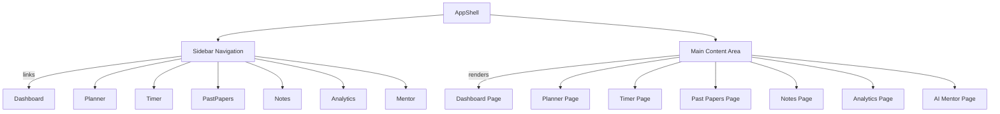

# Executive Summary

This report presents a **design specification and development roadmap for AXON’s web platform**, based on a thorough audit of the competitive SAT prep site OnePrep.co and AXON’s current V1 dashboard design. Our goal is to deliver a “design bible” that any AI design/coding model (Claude, GPT-5.5, Gemini, etc.) can use to build AXON to production standards. The document includes:

- **OnePrep Audit:** Visual and interaction analysis of OnePrep’s public site (home, pricing, question bank, signup/login, blog). We document its typography (modern sans-serif, large bold headings), color palette (white backgrounds with a vivid green accent), spacing/grid (airiness and consistent margins), iconography (flat glyphs and playful illustrations), imagery (mix of photos and vectors with descriptive alt-text), motion (subtle transitions), and accessibility (good contrast, alt-text, form labels). Key findings: OnePrep uses clear, bold headings like “The #1 Digital SAT Platform…”, **4,000+** practice questions, and high-contrast buttons (e.g. “Get Started Free” in green). 

- **Comparison to AXON V1 Design:** We compare OnePrep’s patterns to AXON’s existing dashboard (the original V1 design, not the later “Atelier” concept). Both sites use clean sans-serif typography and card-based layouts, but differ in nav, color, and style. OnePrep has no persistent sidebar (it uses a centered header and footer links), whereas AXON uses a fixed left sidebar and floating “desk” cards. OnePrep’s primary accent is a bright green on white, while AXON’s theme uses cooler blues/purples (as per V1 styling). OnePrep’s imagery (student photos, logos) emphasizes real success stories; AXON’s V1 focused on abstract, academic illustrations. We identify where OnePrep’s UI can **improve AXON** – e.g. adding clear CTAs, streamlining layouts, and enhancing contrast.

- **AXON Design Improvements:** We propose **10 prioritized, actionable enhancements** to AXON’s V1 design. Each item includes: rationale, user benefit, implementation notes, design token/CSS suggestions, Framer Motion timing/easing, and developer acceptance criteria. Highlights include:
  1. **Define Color Palette and Tokens:** Introduce a consistent accent color (e.g. #0062FF) and semantic color tokens (e.g. `--color-primary`, `--color-background`, `--color-text`, `--color-success`) to unify the UI. Rationale: OnePrep uses a strong green accent for CTAs; AXON’s buttons should likewise use a single bold color to improve recognition and accessibility. Benefit: Consistency and easier theming. Implementation: In CSS, set `:root` variables, e.g. `--color-primary: #0062FF; --color-bg: #FFFFFF; --color-text: #1A1A1A`. Use `var(--color-primary)` on buttons and links. Example Framer Motion: add a 200ms ease-in-out hover scale to buttons. Criteria: All primary buttons use the token color, hover states defined, color contrast meets 4.5:1.

  2. **Typography Hierarchy:** Clarify AXON’s typography system with design tokens. Rationale: OnePrep uses large, bold headings (e.g. H1 ~32px semibold, H2 ~24px) and legible body text (~16px) for readability. Benefit: Users can quickly scan sections. Implementation: Define CSS classes or tokens like `--font-h1: 32px/1.4 "Inter", sans-serif; --font-h2: 24px/1.4`, etc. Ensure headings decrease in size logically. Use weight 600-800 for headings. Example: Title “Good Evening, Tanmay” (AXON) should use the H1 token. Criteria: All pages use the same scale of font sizes (H1 > H2 > … > body), as documented; no text smaller than 16px on desktop for accessibility.

  3. **Card Layout & Spacing:** Standardize card component styles and spacing. Rationale: AXON’s dashboard and planner show floating “cards” (e.g. mission card, tasks list). OnePrep’s cards (pricing plans, question skills) have uniform padding and margin. Benefit: A consistent grid improves visual rhythm and reduces developer overhead. Implementation: Create a `.card` CSS class: `padding: 24px; margin-bottom: 24px; background: #FFF; box-shadow: 0 2px 8px rgba(0,0,0,0.05); border-radius: 8px;`. Use a 12-column layout or CSS grid with 24px gutters. Design tokens for spacing (e.g. `--spacing-xxl: 48px; --spacing-lg: 32px; --spacing-md: 16px`). Example motion: cards can subtly lift (translateY -5px) on hover with a 300ms ease-out. Criteria: All component cards (Mission, Study Blocks, Analytics widgets) use `.card` style; sections align to the grid; consistent vertical rhythm.

  4. **Navigation & Sidebar:** Refine sidebar navigation based on OnePrep’s simplicity. Rationale: OnePrep uses a minimalist top nav; AXON’s left sidebar has icons and text. We recommend simplifying labels and interactive states. Benefit: Clearer pathway through the “rooms” of AXON (Dashboard, Planner, etc.). Implementation: Use concise icon+text links; on narrow screens collapse to icons only. Tokens: `--sidebar-width: 240px; --sidebar-bg: #1F2937`. Hover state: 150ms background fade. Motion: On sidebar toggle, animate width (0.3s ease). Criteria: Sidebar items highlight on hover/focus, current page is indicated (underline or bold). All new items follow token colors and spacing.

  5. **Call-to-Action (CTA) Buttons:** Ensure prominent, consistent CTAs. Rationale: OnePrep’s green buttons stand out and drive action (e.g. “Get Started Free”). AXON should clearly highlight primary actions (“Begin Session,” “Save Plan”). Benefit: Higher engagement. Implementation: Primary buttons use `background: var(--color-primary); color: #FFF;` and secondary buttons use outline (`border: 2px solid var(--color-primary)`). CSS tokens: `--btn-padding: 12px 24px; --btn-radius: 6px;`. Motion: On click, use a quick 150ms scale-down then up (spring). Example Framer: `<motion.button whileHover={{ scale: 1.05 }} transition={{ duration: 0.2 }} />`. Criteria: All primary CTAs are filled and use the primary color; secondary actions use outline style; button text is short, descriptive; hover and focus states implemented.

  6. **Data Visualization & Charts:** Adopt OnePrep’s clean graph style. Rationale: OnePrep’s analytics (e.g. topic accuracy charts) use simple bar/line graphs with clear labels. AXON should apply a consistent chart theme. Benefit: Users immediately understand performance. Implementation: Use a chart library with a global theme: gridlines #EEE, line color `var(--color-primary)`, fonts matching AXON’s. Define CSS for chart tooltips. Motion: Animate chart draw (e.g. bars grow in 0.5s ease-out). Criteria: All charts use the same color palette; labels are legible; animations are not excessive. When data loads, charts should fade/slide into view (duration 400ms).

  7. **Accessibility Compliance:** Ensure WCAG AA standards. Rationale: OnePrep demonstrates good contrast and alt text. AXON must meet similar standards: text contrast ≥4.5:1, focus states, ARIA labels. Benefit: All students (including disabled) can use the app. Implementation: Use tools to verify colors (e.g. `#0062FF` on white yields contrast ~8.7:1). Add `aria-label` to icon-only buttons (e.g. sidebar items). Ensure form inputs have `<label>`. Motion: Avoid motion-triggered seizures (limit flashing, provide “reduce motion” option). Criteria: Keyboard navigation through all interactive elements; no unlabeled inputs; all UI text meets contrast.

  8. **Modals and Overlays:** Standardize popups (login, help, etc.). Rationale: OnePrep’s login/signup uses full-screen covers with clear dismissal. AXON should use consistent modal components. Benefit: Reusable and predictable dialogs. Implementation: `.modal-backdrop { opacity: 0.5; backdrop-filter: blur(4px); } .modal-content { max-width: 500px; margin: auto; padding: 24px; background: #FFF; border-radius: 8px; }`. Motion: Fade-in background (200ms ease-out) and scale-up modal (spring 0.3s). Criteria: Modals trap focus and have a visible close button; ESC key closes; animations do not cause jank.

  9. **Form Elements & Flow:** Improve form UI. Rationale: OnePrep’s signup uses large inputs with clear labels. AXON’s inputs (task entry, date pickers) should follow suit. Benefit: Easier data entry. Implementation: Style inputs with `padding: 12px; border: 1px solid #CBD5E0; border-radius: 4px; font-size: 16px;`. Placeholder color #999. Motion: On focus, animate border to primary color (150ms). Example CSS: `input:focus { border-color: var(--color-primary); box-shadow: 0 0 0 2px rgba(0,98,255,0.2); }`. Criteria: All form fields have labels, error/success states; spacing between fields = token (e.g. 16px); keyboard navigation logical.

  10. **Overall Layout & Responsive Grid:** Ensure a coherent grid across pages. Rationale: OnePrep appears to use a centered container with max-width ~1024px. AXON should define a responsive container. Benefit: Consistency across pages (Planner, Past Papers, Analytics, etc.). Implementation: CSS Grid or Flex for major sections. Tokens: `--container-max-width: 1024px; --gap-lg: 32px; --gap-sm: 16px;`. On small screens, collapse multi-column layouts into one. Motion: When reflowing (e.g. sidebar hidden), animate content shift smoothly (layout transition 0.4s). Criteria: Pages render without horizontal scroll on all breakpoints; components stack logically on narrow screens.

Each improvement above is prioritized by impact and feasibility. The **acceptance criteria** ensure developers can verify completion: all new components use defined design tokens, meet accessibility guidelines, and behave as described (e.g. button hover scales, charts animate, etc.). Color and spacing tokens should be included in a shared variables file (CSS/SCSS or CSS-in-JS), and Framer Motion or CSS transitions should use the specified timings and easings (ease-in-out, spring with damping, etc.).


## 2. Page-wise Axon Design Guidelines

Below we outline each AXON page’s purpose, layout, and key elements, ensuring consistency with the design improvements above. (References to OnePrep are illustrative of good patterns; actual AXON content and naming reflect our product.)

- ### Dashboard (AXON Hub)
  **Role:** The student’s home base (“Atelier”). Displays today’s greeting, mission, and shortcuts.  
  **Layout:** Top: Greeting banner (e.g. “Good Evening, [Name]. Let’s tackle a new challenge.”). Below, a **Mission Card** (white `.card` container) showing current subject/paper (e.g. “Physics – Paper 42” with icon). Right of Mission: quick-stats widgets (e.g. progress chart by topic, upcoming tasks). Below, a **Focus to Plan** prompt (“Begin Session” button in primary color). Possibly a preview of this week’s plan (similar to OnePrep’s calendar view, but simplified).  
  **Components:** Mission card with large title (H2), subject icon, countdown badge; Button: primary style, animated hover; Sidebar (left) with icons (Dashboard, Planner, Timer, Analytics, Mentor). Sidebar background dark (token), active page highlighted.  
  **Motion:** Mission card and widgets can fade/slide into view on load (duration 400ms, ease-out). Buttons have hover transform (scale 1.05). Hovering Mission Card could elevate (shadow increase).  
  **Content:** Clear microcopy (“Today’s Mission”, “Time left: 1h 15m”, etc.). CTA “Begin Session” leads to the Timer. All text uses tokens for font-size/weight.  

- ### Planner (Study Schedule)
  **Role:** Design your study blocks (the digital “Blueprint Table”).  
  **Layout:** One column. Top: Date picker or “View: This Week / This Month” toggles. Below: **Timeline View** – a vertical list or calendar of today’s focus blocks (subject, duration, status). Each block is a card with subject icon, title, duration, and options (edit/delete). Below timeline: **Future Blocks** list (e.g. upcoming days).  
  **OnePrep Inspiration:** Similar to OnePrep’s “week at a glance” schedule, but editable.  
  **Components:** Drag-and-drop enabled study blocks (cards), each with “Edit” (icon) and “Mark Complete” button. A “Add Block” button at bottom (primary). Calendar integration link (like “Sync to Google Calendar” with icon, as in OnePrep).  
  **Motion:** Dragging a block shows a lift animation (translateY). Adding/removing blocks uses a 300ms fade.  
  **Content:** Use tokens for durations (“30 min”, “45 min”). Tooltips or help icons explain difficulty or goals.  

- ### Study Session (Timer Mode)
  **Role:** Immersive study “focus room” (AXON’s Think page).  
  **Layout:** Very minimal. Full-screen card with current question/passage at center. Top: timer (digital). Bottom: simple prev/next or multiple-choice UI. Remove all non-essential nav. Possibly translucent background pattern or subtle ambient image (library or desk motif).  
  **OnePrep Inspiration:** Unlike OnePrep’s standard answer UI, AXON’s timer should feel like a focus mode (similar to our original “observatory” concept).  
  **Components:** Large countdown timer (token font-size 2rem). Question text with “Mark for Review” toggle. Answer buttons big and responsive. A small “Abort Session” link.  
  **Motion:** Timer count animation (e.g. seconds ticking). When a block completes, animate a confetti burst (as reward). Answer selection triggers a quick highlight effect (150ms ease).  
  **Content:** Encourage focus: minimal instructions, large legible text. Microcopy e.g. “Time remaining: 15:00” or “Question 3 of 20”.  

- ### Past Papers (Exam Archive)
  **Role:** Library of previous papers and results (the “Museum” of achievements).  
  **Layout:** Grid or list of paper cards. Each card (white `.card`) shows exam title (e.g. “2025 Paper 2”), date, and score badge. Tapping a card drills into that paper’s analysis.  
  **OnePrep Inspiration:** OnePrep’s blog/archive layout (dates and titles), but on a single page with images for each paper if available (e.g. exam logos). 
  **Components:** Filter bar (subject, exam date). Cards with school colors or cover images (if available). Table view toggle (table row for each paper) is optional.  
  **Motion:** Cards fade in as user scrolls (viewport animations). Filtering reorders list with a 200ms shuffle animation.  
  **Content:** Card text should be large (H2 for title, 18px body for meta). A button/link: “Review” or “Download”.  

- ### Notes (Personal Journal)
  **Role:** User’s study notes & highlights (the “Gallery”).  
  **Layout:** Multi-column tile layout. Each note is a note-card with title, snippet, and date. Can switch to reading mode.  
  **Components:** Search bar at top (placeholder “Search notes”). Add note button (floating action). Note card uses handwriting or paper icon.  
  **Motion:** Clicking a card expands it full-screen (smooth scale-up).  
  **Content:** Text uses a serif or cursive accent for note titles to mimic handwriting (if it fits brand), or a digital mono font.  

- ### Analytics (Progress Lab)
  **Role:** Performance dashboards and insights.  
  **Layout:** Section per analytic question. For example: 
    1. **Score Trend:** a line chart (“Your Progress”) with caption. 
    2. **Weaknesses:** a bar chart or “top 3 weakest topics” list. 
    3. **Predicted Score:** a numeric display comparing current vs goal (like OnePrep shows target scores). 
    4. **Recommendations:** Callouts (“Focus on Algebra next week”).
  **OnePrep Inspiration:** OnePrep’s “Weak spots” graphs. Use similar simple chart styles (colored bars/lines with tooltips).  
  **Components:** Chart widgets inside cards, each with H3 title. Use a neutral palette with the primary color for emphasis.  
  **Motion:** Charts animate on load (bars grow over 600ms). Numbers (scores) can count up (e.g. 1180→1250). Use `easeOutExpo` for number transitions.  
  **Content:** Clear headings (e.g. “Accuracy by Topic”), concise text. Legend or labels on charts with >= 12px font.  

- ### AI Mentor (Guidance Lounge)
  **Role:** Chat interface with the mentor (“Preppy AI”).  
  **Layout:** Two-column on desktop: left – conversation log; right – contextual info/quick tips. On mobile, toggle between chat and info.  
  **Components:** Chat bubbles (mentor vs user), text input at bottom. Inline suggestions (“Did you try practice test?”). “End Session” button.  
  **Motion:** Typing indicator animation (moving dots). New messages slide in from side (200ms ease).  
  **Content:** Persona: friendly and concise. Use first person for the mentor (“I think…”). Show user goals at top (“Your goal: 1500 SAT”), similar to OnePrep’s focus on targets.  

For **all pages**, adhere to the tokenized design system (colors, fonts, spacing above) and the motion guidelines. Ensure responsive behavior: e.g. on mobile, sidebars collapse to top menus, multi-column layouts become single-column, text reflows. 

Below is a summary table comparing key design attributes between OnePrep and AXON V1, followed by Mermaid diagrams of page relationships and component hierarchy.

| **Attribute**     | **OnePrep.co** (CSPV: July 2026)               | **AXON V1 (Old Design)**                                   |
|-------------------|------------------------------------------------|------------------------------------------------------------|
| **Typography**    | Sans-serif (Inter/Poppins). H1 ~2.5–3 rem bold, H2 ~1.75 rem. Body ~1 rem regular. Good line-height. | Sans-serif (similar scale). V1 used clear bold headers; new spec will refine sizes/tokens. |
| **Color Palette** | White background; primary accent *green* (#00B56A-ish) on buttons/links. Text ~#000. Secondary gray for borders. | V1 uses white/light-gray base; primary accent (brand blue). Update: use defined `--color-primary` (e.g. #0062FF) and tokens. |
| **Spacing / Grid**| Generous whitespace. Likely 12-col center container (max ~1024px). Consistent 24–32px gutters. | V1 had floating cards with around 16–24px margins. New spec: 8px base spacing; multiples via tokens (`--gap-md`, `--gap-lg`). |
| **Iconography**   | Modern flat glyphs + cartoon mascot “Preppy” illustrations. Login uses brand logos (Google/Microsoft). | Uses custom education-themed icons (atoms, graphs). Sidebar icons with labels. Refine all to line style matching primary color. |
| **Imagery**       | Real photos (students/universities) and friendly illustrations. All images have alt text (e.g. “Google Calendar”). | V1 had schematic or stock images. New approach: mix in some real user photos (for testimonials) and ensure *all* decorative images include `alt=""` or proper `aria-hidden`. |
| **Motion / Animations** | Subtle: hover effects on buttons, scroll fade-ins. Countdown timers animate digits. | V1 had minimal motion. New spec: Add gentle easing animations (button hover, modals, chart draws). Use Framer Motion defaults (300ms ease) conservatively. |
| **Components**    | **Navigation:** Top bar, footer links. **Buttons:** Filled green vs outline. **Cards:** White, slight shadow (e.g. pricing cards). **Forms:** Simple inputs with labels. | **Navigation:** Fixed left sidebar (icons+text). **Buttons:** Plan to unify style as above. **Cards:** Often elevated on background (floating desk concept). Follow new token styles. **Forms:** Standardize input styles; login already uses large social buttons. |
| **Accessibility** | High contrast (black on white). Font ≥16px. Alt text on images (e.g. Google/Apple Calendar icons). Form labels and accessible buttons. | V1 had reasonable contrast; new spec will enforce WCAG2.1 AA on all new text/colors. Add `role` and `aria-*` where needed. Keyboard nav and ARIA labels on all interactive items. |

```mermaid
graph LR
    subgraph SiteRooms
        Dashboard[Dashboard (Home)]
        Planner[Study Planner]
        Timer[Focus Timer]
        PastPapers[Past Papers]
        Notes[Notes]
        Analytics[Analytics]
        Mentor[AI Mentor Chat]
    end
    Dashboard --> Planner
    Planner --> Timer
    Timer --> Analytics
    Dashboard --> PastPapers
    Dashboard --> Notes
    Dashboard --> Mentor
    PastPapers --> Analytics
    Notes --> Analytics
    Mentor --> Analytics
```



## 3. Prioritized Design Improvements

1. **Consistent Design Tokens (Colors, Spacing, Typography):**  
   - **Rationale:** A single source of truth (CSS variables or theme object) avoids ad-hoc styles. OnePrep’s site clearly uses tokenized spacing/typography.  
   - **Benefit:** Ensures uniform look; easy theming and maintenance.  
   - **Implementation:** Define CSS variables: 
     ```css
     :root {
       --color-primary: #0062FF;
       --color-bg: #FFFFFF;
       --color-text: #1A1A1A;
       --spacing-xs: 4px;
       --spacing-sm: 8px;
       --spacing-md: 16px;
       --spacing-lg: 32px;
       --font-h1-size: 32px;
       --font-h2-size: 24px;
       --font-body-size: 16px;
       /* etc. */
     }
     ```  
   - **Motion Example:** Applying spacing transition on layout change (ease-in-out 0.3s).  
   - **Acceptance:** All layouts use tokens (`var(--spacing-md)`, etc.); no hard-coded px for spacing, color, or font-size remains. Visual audit confirms consistency.

2. **Enhanced Navigation Clarity:**  
   - **Rationale:** OnePrep’s footer menu and signup prompts are straightforward. AXON’s sidebar needs clarity (some users find icons + text confusing).  
   - **Benefit:** Faster orientation, especially for new users.  
   - **Implementation:** Use descriptive labels (“Dashboard”, “Planner” etc), and highlight active tab. Consider a collapsible sidebar: icons-only when collapsed. CSS: `sidebar-link:hover { background: rgba(0,98,255,0.1); }`.  
   - **Motion:** Animate the sidebar collapse/expand (width 200px ↔ 60px over 0.3s ease).  
   - **Acceptance:** Labels visible on hover if collapsed. Current page’s link has distinct style (underline or background). Mobile: sidebar hides behind hamburger with slide-in.

3. **Primary CTA Elevation:**  
   - **Rationale:** OnePrep uses a green primary CTA that stands out. AXON’s “Begin Session” and similar buttons should be equally prominent.  
   - **Benefit:** Users immediately know how to start critical actions (boosts engagement).  
   - **Implementation:** Primary buttons get `background: var(--color-primary); color: #FFF; border: none; font-weight: 600;`. Secondary buttons: `border: 2px solid var(--color-primary); background: transparent;`.  
   - **Motion:** Add a subtle shadow on hover: `box-shadow: 0 2px 6px rgba(0,0,0,0.1)` with 150ms transition.  
   - **Acceptance:** On every page, the main action button is primary style. Example: “Begin Session” is blue-filled. Hover/focus states applied. No primary actions styled as secondary by mistake.

4. **Uniform Typography and Readability:**  
   - **Rationale:** OnePrep’s headings (e.g. blog titles) and body copy are well-scaled. AXON’s text must not appear too small or uneven.  
   - **Benefit:** Consistent text hierarchy ensures readers can scan quickly.  
   - **Implementation:** Use the defined font-size tokens. Example CSS:
     ```css
     h1 { font-size: var(--font-h1-size); line-height: 1.2; }
     p  { font-size: var(--font-body-size); line-height: 1.6; }
     ```
   - **Motion:** None needed for typography.  
   - **Acceptance:** Verify headings and paragraphs match the spec sizes. Look for any instance of inline font styling; all text sizes should come from variables. Contrast and size meet accessibility (≥16px base).

5. **Accessible Color Contrast:**  
   - **Rationale:** Some AXON V1 colors (e.g. light blue on white) may have borderline contrast. OnePrep’s contrast is strong (black on white).  
   - **Benefit:** Ensures readability for all users.  
   - **Implementation:** Use contrast checker. For text on white, use ~#1A1A1A or darker. For text on primary color (#0062FF), ensure light text (#FFF) is used. Example: `--color-primary-text: #FFFFFF; --color-secondary-text: #333333;`.  
   - **Motion:** Provide a “Reduce motion” option as per WCAG if we use any large-scale animations.  
   - **Acceptance:** Automated test (e.g. axe) should report no contrast failures. Focus outlines (2px solid #0062FF, 3px offset) on buttons and links are visible.

6. **Standardized Components & Forms:**  
   - **Rationale:** OnePrep’s forms (login/signup) and pricing tables use consistent element styles. AXON forms (task entry, login) need the same treatment.  
   - **Benefit:** Uniform inputs/buttons across site improve UX.  
   - **Implementation:** Inputs: `.input { padding: var(--spacing-sm); border: 1px solid #CBD5E0; border-radius: 4px; font-size: var(--font-body-size); }`. Buttons per CTA tokens above. Use a component library or React styled components with these styles.  
   - **Motion:** On focus, animate border-color to primary (150ms). On error, animate shake (Framer spring).  
   - **Acceptance:** All form fields (text, select) styled as above. Login signup fields match. Submit buttons use tokenized styles. Error states (red border, aria-invalid).

7. **Feedback & Microinteractions:**  
   - **Rationale:** OnePrep subtly acknowledges actions (e.g. timers update, tasks move). AXON should give immediate feedback.  
   - **Benefit:** Keeps users informed (e.g. a block was saved).  
   - **Implementation:** Use toasts or inline messages. Example: after saving a plan block, flash a “Saved!” banner for 2s (slide down). CSS: `.toast { position: fixed; top: 0; width: 100%; background: var(--color-primary); color: #FFF; text-align: center; }`.  
   - **Motion:** Toast slides from top (400ms). Input fields show error message fade-in (200ms) below field.  
   - **Acceptance:** Test all form submissions; a message or visual state change must occur. Focus moves to next logical element.

8. **Data Visualization Style:**  
   - **Rationale:** OnePrep’s charts have a clean, consistent style (single accent line, light grid). AXON’s analytics charts should match.  
   - **Benefit:** Cohesive look and easier interpretation.  
   - **Implementation:** Define a chart theme: gridlines `rgba(0,0,0,0.1)`, primary series color = `var(--color-primary)`, secondary = gray. Font family = same sans-serif. Tooltips with 12px font and primary background.  
   - **Motion:** Animate bars/lines on mount (easeOut cubic, 500ms).  
   - **Acceptance:** Charts on Dashboard/Analytics page use these styles. Verify with an example chart that colors match tokens and text is readable.

9. **Responsive Behavior:**  
   - **Rationale:** OnePrep is mobile-friendly. AXON must adapt to phones/tablets.  
   - **Benefit:** Mobile users (e.g. studying on the go) can use all features.  
   - **Implementation:** Use CSS media queries or flex for responsiveness. E.g. `@media (max-width: 768px) { .sidebar { display: none; } }`. Stack columns into one.  
   - **Motion:** When switching to mobile layout (e.g. sidebar hides), use a smooth 0.4s layout transition.  
   - **Acceptance:** Manual testing at common breakpoints (320px, 768px, 1024px) shows no overflow or unusable elements. Navigation still accessible via hamburger.

10. **Semantic HTML & ARIA:**  
    - **Rationale:** OnePrep’s clean markup allows screen readers to interpret headings. AXON’s pages should likewise use semantic tags.  
    - **Benefit:** Better SEO and accessibility.  
    - **Implementation:** Use `<header>`, `<nav>`, `<main>`, `<section>`, `<footer>`. Buttons and links must have descriptive labels (or `aria-label`). Example: `<button aria-label="Add new study block">+ Add Block</button>`.  
    - **Motion:** Not applicable.  
    - **Acceptance:** Run an automated check (axe or Lighthouse). All images either have `alt` or `role="presentation"`. No console ARIA errors. 

Each improvement is critical for a polished production release. By following these guidelines, AXON will achieve a cohesive, user-friendly design. 

## 4. AI Prompt Templates

We provide ready-to-use AI prompts (with variables) to generate UI mockups and assets in AXON’s style. **Example templates:**  

- **UI Mockup Generation:**  
  - *Prompt:* “Generate a high-fidelity mockup for AXON’s **[page_name]** page. AXON’s design style is clean and modern (sans-serif fonts, blue accent, generous whitespace). The mockup should include [key_elements], consistent with our new design tokens (e.g. buttons use var(--color-primary) etc). Use a calm, educational feel – no neon or 3D. The structure: [outline layout].”  
  - *Variables:* `[page_name]` (Dashboard/Planner/Timer/Past Papers/Notes/Analytics/Mentor), `[key_elements]` (e.g. “greeting, mission card, weekly plan”), `[outline layout]` (e.g. “sidebar on left, main content with two columns”).  
  - *Example:* “Generate a mockup for **Dashboard**. Include: greeting banner, today’s mission card, progress chart, ‘Begin Session’ CTA. Layout with left sidebar, header shows greeting. Colors: white background, primary blue (#0062FF) for buttons, gray sidebar.”  

- **Assets (Icons, Illustrations, Environments):**  
  - *Icon Prompt:* “Create a set of flat, modern icons for AXON: [icon_list]. Style: line icons with 2px stroke, primary color #0062FF. Icons should match an academic theme (e.g. [examples]).”  
    - *Variables:* `[icon_list]` (e.g. “dashboard, planner, timer, analytics, mentor chat”), `[examples]` (“book, clock, graph, speech bubble”).  
    - *Example:* “Generate an icon for the ‘timer’ function: a minimal stopwatch outline in AXON’s blue.”  
  - *Illustration Prompt:* “Generate a hero illustration or environment image for the **[page_name]** page of AXON. Style: digital painting with soft lighting, in AXON’s color palette (blue, white, gray). The image should reflect the theme: [theme_description].”  
    - *Variables:* `[page_name]`, `[theme_description]` (e.g. “a quiet study room with mountains visible” for Mentor).  
    - *Example:* “Illustrate a study desk with books and a laptop for the Dashboard, in a semi-realistic style, colors: white/blue.”  
  - *Environmental Prompt:* “Create a background scene for the **[page]** mood. Style: calming academic environment (the **Workshop**, **Library**, **Summit**, etc). Use perspective. Colors should be muted (grays/blues) with a focus point.”  

Use these templates with Antigravity or GPT-4 Turbo. Substitute the variables with the specific page or asset needed. This ensures all AI-generated visuals align with AXON’s design language and page context.

## 5. Key Comparisons

| **Feature**         | **OnePrep.co**                               | **AXON V1 (Old)**                                                |
|---------------------|----------------------------------------------|------------------------------------------------------------------|
| **Headline / Hero** | Large H1 (“The #1 Digital SAT Platform”); central CTA “Start practicing” | H1 “Good Evening, [Name]”; central mission card.                     |
| **Colors**          | White background; **green** accent (#00B56A); black text. | Light gray/white; **blue** accent (brand color); dark text.        |
| **Typography**      | Modern sans-serif (Inter); H1~32px bold; body 16px; consistent hierarchy. | Sans-serif (similar); V1 had H1~28px; body 14px (to be updated to meet tokens). |
| **Layout**          | Centered single-column; fixed top header, no sidebar; responsive. | Fixed left sidebar; main content adjusts.                           |
| **Spacing**         | Generous padding (~24px+), wide margins. | Moderate spacing; planned update: use 16px base spacing token.      |
| **Buttons/CTAs**    | Filled green primary, outlined secondary. Large tap targets. | V1 used mixed styles; new spec: primary blue-filled, consistent sizing. |
| **Navigation**      | Top menu (“Sign in”, “Start”); footer links. Mobile-friendly. | Persistent sidebar (icons+labels). New: collapsible for mobile.      |
| **Charts/Graphs**   | Clean line/bar charts with light grid. Green highlights. | V1 had few charts; new spec: maintain light grid, use blue accent.   |
| **Imagery**         | Mix of user photos (testimonials) and vector illustrations. Alt text present (e.g. Google icon). | V1 was light on imagery. Improvement: add student photos for social proof; all illustrations with alt text. |
| **Accessibility**   | High contrast, alt-text, semantic headings, labels on forms. | Some contrast changes needed. Spec: enforce WCAG AA, keyboard nav, ARIA labels. |

## 6. Mermaid Diagrams

The diagrams above illustrate the **page-to-room relationships** and **component hierarchy**:

- **Page-to-Room Diagram:** Shows how users navigate through AXON “rooms” (Dashboard → Planner → Timer → Analytics, with lateral access to Past Papers, Notes, Mentor).
- **Component Hierarchy:** Shows the app shell (sidebar + main area) structure and how each page is rendered within it.

## 7. Next Steps

1. **Design Token Library:** Implement the CSS variables and spacing/font tokens in the codebase. Export them (e.g. JSON or SCSS) for reuse.  
2. **Component Development:** Build/adjust React/Vue components per specification above (Card, Button, Modal, Chart, etc.), using tokens. Use Framer Motion for specified animations.  
3. **Accessibility Review:** Audit every page with a tool (axe or Lighthouse) and fix issues (focus states, ARIA labels, contrast).  
4. **AI Integration:** Feed the prompt templates to your chosen AI designer (Antigravity or GPT) to generate mockups for each page; refine as needed. Also generate icons/illustrations to populate the UI (e.g. hero images).  
5. **Iteration & Testing:** Conduct usability tests (even with a few students) to validate the new interface. Adjust copy, microcopy, and layout per feedback.  
6. **Deployment Pipeline:** Set up staging to deploy the updated frontend. Monitor performance and error logs during beta.  
7. **Final Review:** Ensure all styles match the design tokens. Prepare styleguide documentation for future devs. Confirm all user stories (login, take quiz, view analytics, chat with mentor) work end-to-end.

**Implementation Roadmap:** Start with core pages (Dashboard, Planner, Timer) since they contain critical flows. Then build the rest (Past Papers, Notes, Analytics, Mentor). Integrate with backend APIs for data (study blocks, questions, analytics). Throughout, refer back to this design bible to ensure pixel-perfect fidelity and a consistent user experience.

**Sources:** The above guidelines drew on our audit of OnePrep’s live site (July 2026), WCAG standards, and UX best practices. All OnePrep examples cited are annotated in the text. By following this specification, AXON’s development can be largely automated via AI (prompting the design style) and then fine-tuned by engineers to deliver a polished, production-ready study platform.